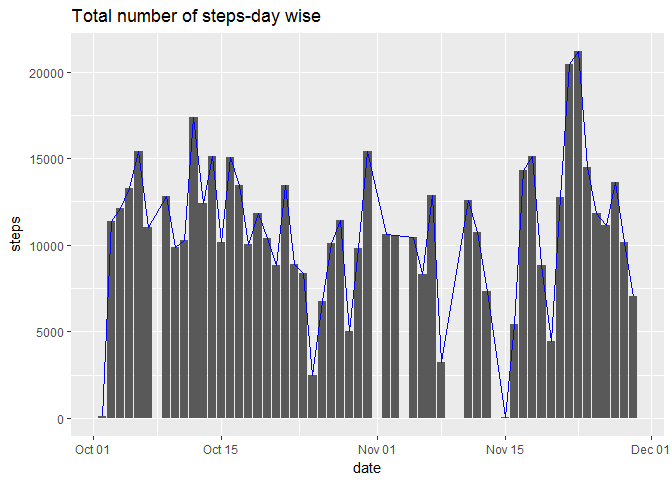
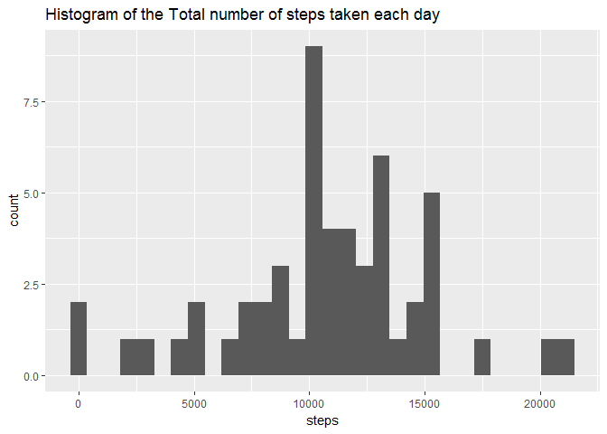
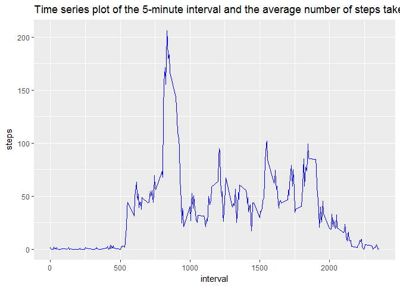
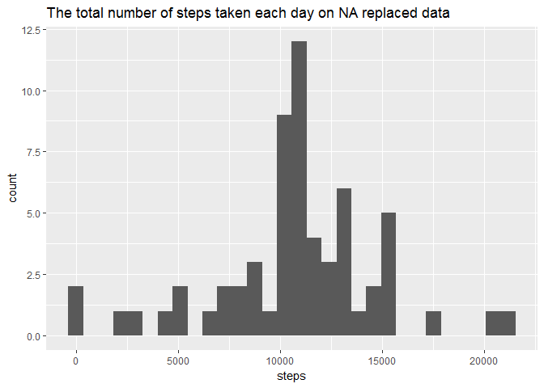
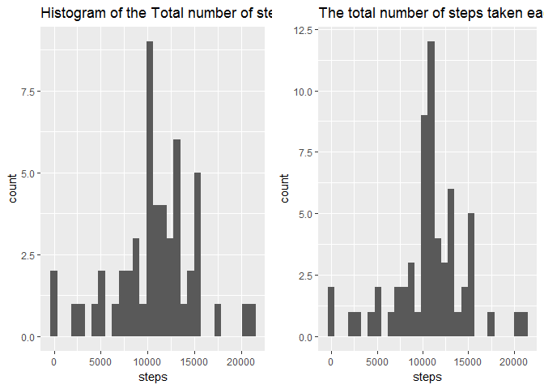
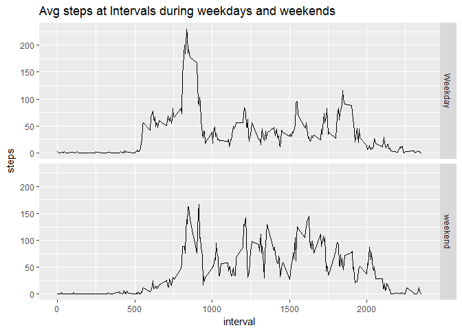

# Reproducible Research: Peer Assessment 1


## Loading and preprocessing the data

1. Download the data if not exists and unzip the data.

```r
library(knitr)
```

```
## Warning: package 'knitr' was built under R version 3.3.3
```

```r
setwd("C:/Users/Sourav/Documents/Technical/Data Science/Coursera Data Science Specialization/Coursera_05_Reproducible Research/data")
if (!file.exists("./activity.zip"))
{
    fileurl <- "https://d396qusza40orc.cloudfront.net/repdata%2Fdata%2Factivity.zip"
  download.file(fileurl,destfile = "./activity.zip")
  
} 

if (!file.exists("./activity.csv"))
{
unzip("./activity.zip",exdir = getwd())
}
```
2. Read the data and Process/transform(removing NA rows) the data into a format suitable for your analysis.


```r
setwd("C:/Users/Sourav/Documents/Technical/Data Science/Coursera Data Science Specialization/Coursera_05_Reproducible Research/data")
actdat <- read.csv("activity.csv",header = TRUE)
actdat$date <- as.Date(actdat$date,"%Y-%m-%d")
actdatclean <- actdat[complete.cases(actdat[,1]),]
```

## What is mean total number of steps taken per day?

1. Calculate the total number of steps taken per day and visulalize thorugh barplot.


```r
acttot <- aggregate(steps~date,data=actdatclean,sum)
library(ggplot2)
```

```
## Warning: package 'ggplot2' was built under R version 3.3.3
```

```r
g <- ggplot(acttot,aes(date,steps))
g + geom_bar(stat = "identity") + geom_line(color="blue") + ggtitle("Total number of steps-day wise")
```

<!-- -->

2. Make a histogram of the total number of steps taken each day

```r
g1 <- ggplot(acttot,aes(steps))
g1 <- g1 + geom_histogram() + labs(title="Histogram of the Total number of steps taken each day")
g1
```

```
## `stat_bin()` using `bins = 30`. Pick better value with `binwidth`.
```

<!-- -->

3. The  mean and median of the total number of steps taken per day.

```r
mn <- mean(acttot$steps)
med <- median(acttot$steps)
```
The mean of the total number of steps is 10766.19 and the median is 10765.

## What is the average daily activity pattern?

1. Make a time series plot (i.e. type = "l") of the 5-minute interval (x-axis) and the average number of steps taken, averaged across all days (y-axis)

```r
dly_actp <- aggregate(steps~interval,data=actdatclean,mean)
g <- ggplot(dly_actp,aes(interval,steps))
g + geom_line(color="blue") + ggtitle("Time series plot of the 5-minute interval and the average number of steps taken")
```

<!-- -->

2. Which 5-minute interval, on average across all the days in the dataset, contains the maximum number of steps?

```r
dly_actp[which.max(dly_actp$steps),][[1]]
```

```
## [1] 835
```


## Imputing missing values
1. Calculate and report the total number of missing values in the dataset (i.e. the total number of rows with NAs)

```r
missing <- actdat[!complete.cases(actdat),]
dim(missing)[1] 
```

```
## [1] 2304
```

2. Devise a strategy for filling in all of the missing values in the dataset. The strategy does not need to be sophisticated. For example, you could use the mean/median for that day, or the mean for that 5-minute interval, etc.

* Strategy is to replace with the mean for that 5-minute interval calculated above. So merging the full dataset NA with the interval average dataset.


```r
head(actdat)
```

```
##   steps       date interval
## 1    NA 2012-10-01        0
## 2    NA 2012-10-01        5
## 3    NA 2012-10-01       10
## 4    NA 2012-10-01       15
## 5    NA 2012-10-01       20
## 6    NA 2012-10-01       25
```

```r
head(dly_actp)
```

```
##   interval     steps
## 1        0 1.7169811
## 2        5 0.3396226
## 3       10 0.1320755
## 4       15 0.1509434
## 5       20 0.0754717
## 6       25 2.0943396
```

```r
mrgfull <- merge(actdat,dly_actp,by="interval")
mrgfull$steps <- ifelse(is.na(mrgfull$steps.x),mrgfull$steps.y,mrgfull$steps.x)
```

3. Create a new dataset that is equal to the original dataset but with the missing data filled in.


```r
actnonadat <- mrgfull[order(mrgfull$date,mrgfull$interval),c("steps","date","interval")]
head(actnonadat)
```

```
##         steps       date interval
## 1   1.7169811 2012-10-01        0
## 63  0.3396226 2012-10-01        5
## 128 0.1320755 2012-10-01       10
## 205 0.1509434 2012-10-01       15
## 264 0.0754717 2012-10-01       20
## 327 2.0943396 2012-10-01       25
```

4. Make a histogram of the total number of steps taken each day

```r
agractnonadat <- aggregate(steps~date,data=actnonadat,sum)
 g2 <- ggplot(agractnonadat,aes(steps))
 g2 <- g2 + geom_histogram() + ggtitle("The total number of steps taken each day on NA replaced data ")
 g2
```

```
## `stat_bin()` using `bins = 30`. Pick better value with `binwidth`.
```

<!-- -->

5. Calculate and report the mean and median total number of steps 

```r
mn_new <- mean(agractnonadat$steps)
med_new <- median(agractnonadat$steps)
```

The mean of the NA replaced dataset is 10766.19 and the median is 10766.19.

6. Do these values differ from the estimates from the first part of the assignment?

* Earlier Mean was 10766.19 and the new mean(after NA replacement) is 10766.19.

* Earlier Median was 10765 and the new mean(after NA replacement) is 10766.19.

**Total number of steps comparison below.**

```r
library(gridExtra)
```

```
## Warning: package 'gridExtra' was built under R version 3.3.3
```

```r
grid.arrange(g1, g2, ncol = 2)
```

```
## `stat_bin()` using `bins = 30`. Pick better value with `binwidth`.
## `stat_bin()` using `bins = 30`. Pick better value with `binwidth`.
```

<!-- -->

## Are there differences in activity patterns between weekdays and weekends?

1. Create a new factor variable in the dataset with two levels - "weekday" and "weekend" indicating whether a given date is a weekday or weekend day.


```r
actnonadat$day <- weekdays(actnonadat$date)
actnonadat$dayType <- ifelse(actnonadat$day %in% c("Monday","Tuesday","Wednesday","Thursday","Friday"),"Weekday","weekend")
actnonadat$dayType <- as.factor(actnonadat$dayType)
```

2. Make a panel plot containing a time series plot (i.e. type = "l") of the 5-minute interval (x-axis) and the average number of steps taken, averaged across all weekday days or weekend days (y-axis). 


```r
actnonadat_intrvl <- aggregate(steps~interval+dayType,data=actnonadat,mean)

g <- ggplot(actnonadat_intrvl,aes(interval,steps))
g + geom_line() + facet_grid(dayType~.) + ggtitle("Avg steps at Intervals during weekdays and weekends")
```

<!-- -->
